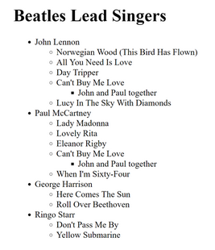
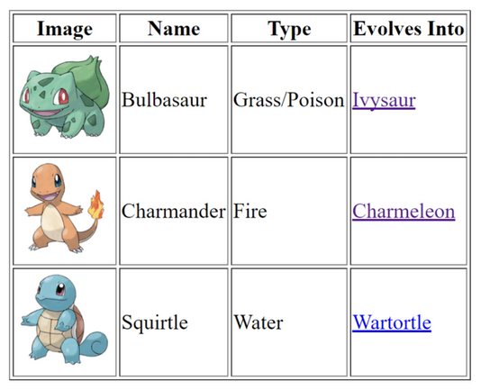
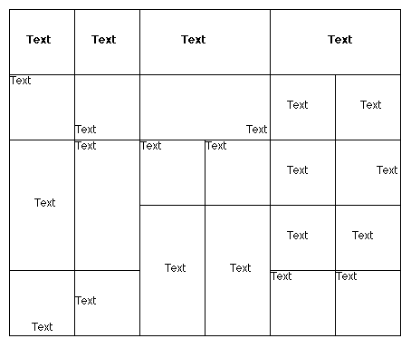
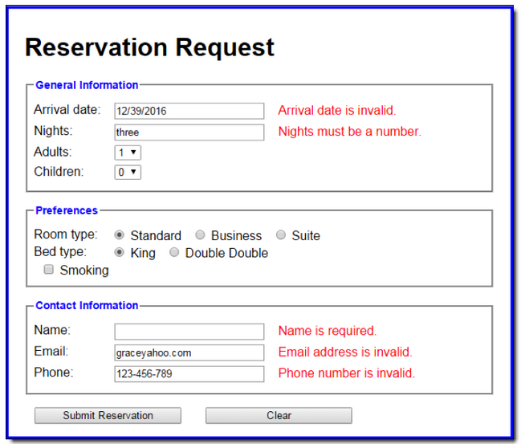

# LM_U2_T1_1920:Basic_HTML

Exercise 1: (ej1.html)
---
>In a file called ex1.html write the HMLT needed for >creating a web page as close as possible as the following >image.

*Note: You must look for further info in order to get the the proper list icons and the right table borders.*

Exercise 2 (ej2.html)
---
*NOTA: Todos lo enlaces se abrirán en una nueva pestaña a la página oficial del Pokemon en cuestión. Revisar el atributo target de los enlaces.*

Exercise 3 (ej3.hmtl)
---
*NOTA: Revisar los atributos text-align y valign de las celdas.*

Exercise 4 (ej4.html)
---
*Note: No debeís tener en cuenta los mensaje en rojo*

